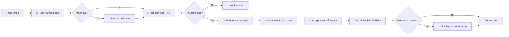

# mini-harness

[](LICENSE)
[](https://github.com/HYX-LHJ/mini-harness/actions/workflows/validate-scaffold.yml)
[](https://github.com/HYX-LHJ/mini-harness/releases)

> 🧩 **Make AI coding agents collaborate like a team** — stateful handoffs, quality gates, and acceptance checks instead of amnesia every new chat.

**[中文 README](README.md)** · [5-min trial](mini-harness/TRIAL.md) · [Changelog](CHANGELOG.md)

---

## ✨ In one sentence

**A portable Agent workflow plugin** — install the plugin for the **using-harness skill** (per-round playbook); run `install` once per repo to scaffold `harness/` state. Works with **Cursor · Codex · Claude Code**.

---

## 🤔 Why you need this

| 😵 Without harness | ✅ With harness |
|--------------------|-----------------|
| Every new chat starts from zero | `PROGRESS.md` + `todo.md` for **session handoff** |
| Code ships without tests or review | **pytest / ruff / mypy gates** + subagent review |
| Plans and reviews only in chat | **Committed to git** |
| Everyone uses a different prompt | Shared **using-harness skill** |
| Project rules live in people's heads | `profile/PROJECT.md` **evolves with the repo** |

---

## 🚀 Quick start

### 1️⃣ Install the plugin (one click)

| Host | Command / action |
|------|------------------|
| **Claude Code** | `/plugin marketplace add HYX-LHJ/mini-harness` → `/plugin install mini-harness@mini-harness` |
| **Cursor** | Dashboard → Plugins → Import `https://github.com/HYX-LHJ/mini-harness` → install **mini-harness** |
| **Codex** | `codex plugin marketplace add github.com/HYX-LHJ/mini-harness` → `codex plugin install mini-harness` |

📖 Details: [docs/en/installation.md](docs/en/installation.md)

### 2️⃣ Activate harness in your project

```bash
python mini-harness/scripts/mini_harness.py install --root .
python harness/scripts/mini_harness.py doctor --root .
```

When you see `ok: true`, you're ready to start an Agent session 🎉

> 💡 **First time?** Follow [TRIAL.md](mini-harness/TRIAL.md) (~5 minutes).

---

## 📦 What you get

| Artifact | Purpose |
|----------|---------|
| `skills/using-harness/SKILL.md` | 📋 Per-round playbook (plugin; copied to `harness/skills/` on install) |
| `harness/todo.md` | ✅ Current task + acceptance criteria (AC) |
| `harness/PROGRESS.md` | 📍 Progress snapshot for session handoff |
| `harness/profile/PROJECT.md` | 🎯 Project portrait — read every round, evolves with the repo |
| `harness/DECISIONS.md` | 🏛️ Major decisions by topic (background / conclusion / impact) |
| `harness/skills/` | 🛠️ Built-in skills (tdd, code-review, acceptance, …) |
| `harness/scripts/` | ⚙️ `mini_harness.py` (install / update / doctor) |
| `tests/` | 🧪 All test files (repo root) |

<details>
<summary>📂 Generated layout</summary>

```text
your-repo/
├── tests/
└── harness/
    ├── todo.md, PROGRESS.md, DECISIONS.md
    ├── profile/          # PROJECT.md, evolution.jsonl (project-owned; update never overwrites)
    ├── skills/, scripts/
    ├── plans/, acceptance/, code_review/, backlog/
    └── ...
```

</details>

---

## 🔄 Workflow overview



Details: [docs/en/workflow.md](docs/en/workflow.md)

---

## 🏗️ This repository

This is the **plugin source repo** — not a pre-activated harness project.

```text
mini-harness/   # 🔧 Authoritative plugin (skills, installer, templates)
docs/           # 📚 User documentation
.github/        # 🤖 CI / Release
```

Edit only `mini-harness/`; run `install` in your own project to get `harness/` and `tests/`. Do not commit those install outputs here.

---

## 📚 Documentation

| English | 中文 |
|---------|------|
| [Getting started](docs/en/getting-started.md) | [快速入门](docs/zh-CN/getting-started.md) |
| [Installation](docs/en/installation.md) | [安装指南](docs/zh-CN/installation.md) |
| [Architecture](docs/en/architecture.md) | [架构说明](docs/zh-CN/architecture.md) |
| [Workflow](docs/en/workflow.md) | [协作流程](docs/zh-CN/workflow.md) |

Plugin maintainer docs: [mini-harness/README.md](mini-harness/README.md) · [using-harness](mini-harness/skills/using-harness/SKILL.md)

---

## ⚙️ Requirements

Python 3.10+ · Agent tool with skill / plugin support · Optional: `ruff`, `pytest`, `mypy`

---

[🤝 Contributing](CONTRIBUTING.md) · [🔒 Security](SECURITY.md) · [📋 Changelog](CHANGELOG.md) · [MIT License](LICENSE)
