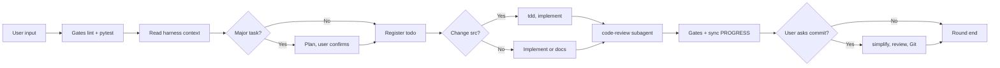
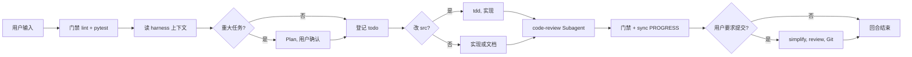

# round-harness

[](LICENSE)
[](https://github.com/HYX-LHJ/round-harness/actions/workflows/validate-scaffold.yml)

**Languages:** [English](#english) · [中文](#中文)

---

## 一句话 · In one sentence

**中文：** 这是一个 **Agent Skill** —— 对 Agent 说一句话，在**任意仓库**自动生成标准协作工程（`harness/`、`AGENTS.md`、门禁脚本），让 AI 编程从「聊天」变成「有纪律的工程回合」。

**English:** A portable **Agent Skill** — tell your agent one sentence, get a full collaboration harness (`harness/`, `AGENTS.md`, gate scripts) in **any repo**, turning AI coding from chat into structured engineering rounds.

```bash
npx skills add HYX-LHJ/round-harness --skill agent-harness -g -y
```

支持 **Cursor · Codex · Claude Code · [Skills CLI](https://skills.sh/)（60+ agents）**

---

## 为什么需要它 · Why you need this

模型越来越强，但很多人用 Agent 写代码时，**瓶颈不在模型，而在缺少协作结构**：

| 没有 harness 时 | 有 harness 之后 |
|----------------|----------------|
| 每开新对话，Agent 从零读代码，上下文断裂 | `PROGRESS.md` + `todo.md` 让新会话**无缝接手** |
| 改完就提交，没有测试 / 审查门禁 | **lint + pytest 门禁**，失败只修门禁 |
| Plan、Code Review 只留在聊天里，无法追溯 | 方案、审查报告**落盘到 git**，可版本化 |
| 每人一套 Prompt，团队无法对齐 | `AGENTS.md` 是**统一的 Playbook**，可提交共享 |

**round-harness 做的事：** 把上述约定变成**可复制、可版本化、一键生成**的工程模板 —— 你不需要从零设计目录、手抄 `AGENTS.md`、写门禁脚本。

| Without harness | With harness |
|-----------------|--------------|
| Every new chat starts from zero — context is lost | `PROGRESS.md` + `todo.md` let the next session **pick up where you left off** |
| Code ships without tests or review gates | **lint + pytest gates** — on failure, fix gates first |
| Plans and reviews live only in chat | Plans and reviews are **committed to git** |
| Everyone uses a different prompt | `AGENTS.md` is a **shared playbook** for the whole team |

**What round-harness does:** turn these conventions into a **copy-paste, version-controlled, one-command** scaffold — no hand-written `AGENTS.md`, no ad-hoc folder design.

---

## 核心能力 · What this Skill delivers

安装 [`agent-harness`](agent-harness/) 后，在目标仓库执行初始化，你会得到：

| 产物 | 作用 |
|------|------|
| **`AGENTS.md`** | Agent 每回合的 Playbook：何时 Plan、何时 TDD、何时 Code Review、如何提交 |
| **`harness/todo.md`** | 当前周任务板 — 有变更必先登记，可勾选、可验收 |
| **`harness/PROGRESS.md`** | 进度快照：分支、门禁、进行中 task — **新会话接手入口** |
| **`harness/DECISIONS.md`** | 架构边界与「不得提交」约束 |
| **`harness/plans/`** | 重大任务先写方案、等用户确认，再写代码 |
| **`harness/code_review/`** | 审查报告落盘 + 未关闭问题追踪 |
| **`harness/scripts/`** | `lint_src` · `sync_progress` · `archive_harness_todo` |
| **`pytest.ini`** | 测试配置（`harness/tests`） |

**一条 Agent 指令即可初始化：**

> 用 agent-harness 在当前仓库创建 harness  
> *Use agent-harness to create harness in this repository*

<details>
<summary>生成后的目录结构 / Generated layout</summary>

```text
your-repo/
├── AGENTS.md                 # Playbook（优先级最高）
├── pytest.ini
└── harness/
    ├── index.md              # 总索引
    ├── todo.md               # 周任务板
    ├── PROGRESS.md           # 进度快照
    ├── DECISIONS.md          # 活跃决策
    ├── plans/                # 方案（Plan 模式）
    ├── code_review/          # 审查报告
    ├── code_simplifier/      # 精炼报告
    ├── tests/                # 单元测试
    ├── scripts/              # 门禁与维护脚本
    └── backlog/              # 历史归档
```

</details>

---

## 30 秒上手 · Get started in 30 seconds

```bash
# 1. 安装 Skill（全局，适用 Cursor / Codex / Claude Code 等）
npx skills add HYX-LHJ/round-harness --skill agent-harness -g -y

# 2. 打开你的项目，对 Agent 说：
#    「用 agent-harness 在当前仓库创建 harness」

# 3. 之后每轮开发，Agent 自动读 AGENTS.md + harness/todo.md + PROGRESS.md
```

手动安装或其它工具路径 → [docs/installation.md](docs/installation.md) · CLI 详解 → [docs/skills-cli.md](docs/skills-cli.md)

---

<a id="english"></a>

## English

### Workflow overview



Each user message = one **round**: gates → read context → [Plan] → todo → [tdd] → implement → [code-review] → gates → PROGRESS. On commit: simplify → second review → Git.

Details: [docs/workflow.md](docs/workflow.md)

### Supported tools

| Tool | Install |
|------|---------|
| Cursor | [installation.md](docs/installation.md#cursor) |
| Codex | [installation.md](docs/installation.md#codex) |
| Claude Code | [installation.md](docs/installation.md#claude-code) |
| Skills CLI | [skills-cli.md](docs/skills-cli.md) |

### Documentation

| Doc | Content |
|-----|---------|
| [getting-started.md](docs/getting-started.md) | First-time setup |
| [installation.md](docs/installation.md) | Multi-tool install |
| [architecture.md](docs/architecture.md) | Directory layout |
| [workflow.md](docs/workflow.md) | Rounds, commits, Plan mode |
| [SKILL.md](agent-harness/SKILL.md) | Agent instructions |

### Requirements

Python 3.10+ · Agent tool with `SKILL.md` support · Optional: `.venv`, `ruff`, `pyright`, `pytest` for gates

[CONTRIBUTING.md](CONTRIBUTING.md) · [SECURITY.md](SECURITY.md) · [CHANGELOG.md](CHANGELOG.md) · [MIT License](LICENSE)

---

<a id="chinese"></a>

## 中文

### 协作流程概览



每次用户输入 = 一**回合**：门禁 → 读上下文 → [Plan] → 登记 todo → [tdd] → 实现 → [code-review] → 门禁 → PROGRESS。提交时：精炼 → 二次审查 → Git。

详细流程：[docs/workflow.md](docs/workflow.md)

### 支持的 Agent 工具

| 工具 | 安装说明 |
|------|----------|
| Cursor | [installation.md](docs/installation.md#cursor) |
| Codex | [installation.md](docs/installation.md#codex) |
| Claude Code | [installation.md](docs/installation.md#claude-code) |
| Skills CLI | [skills-cli.md](docs/skills-cli.md) |

### 文档索引

| 文档 | 内容 |
|------|------|
| [getting-started.md](docs/getting-started.md) | 入门与首次配置 |
| [installation.md](docs/installation.md) | 多工具安装 |
| [architecture.md](docs/architecture.md) | 目录架构 |
| [workflow.md](docs/workflow.md) | 回合流程、提交、Plan |
| [SKILL.md](agent-harness/SKILL.md) | Agent 主指令 |

### 要求

Python 3.10+ · 支持 `SKILL.md` 的 Agent 工具 · 跑通门禁需 `.venv`、`ruff`、`pyright`、`pytest`

[CONTRIBUTING.md](CONTRIBUTING.md) · [SECURITY.md](SECURITY.md) · [CHANGELOG.md](CHANGELOG.md) · [MIT License](LICENSE)
