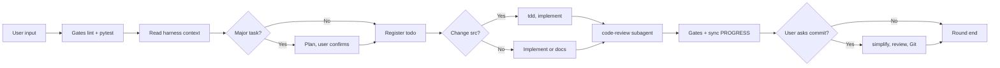

# mini-harness

[](LICENSE)
[](https://github.com/HYX-LHJ/mini-harness/actions/workflows/validate-scaffold.yml)

**[中文 README](README.zh-CN.md)**

---

## In one sentence

**Lightweight Agent Skills (English + Chinese)** — one command to scaffold a mini collaboration harness (`harness/`, `AGENTS.md`, gate scripts) in any repo. Works with **Cursor · Codex · Claude Code · [Skills CLI](https://skills.sh/)**.

---

## Choose your Skill package

| Language | Package | Install |
|----------|---------|---------|
| **English** | [`agent-harness-en/`](agent-harness-en/) | `npx skills add HYX-LHJ/mini-harness --skill agent-harness-en -g -y` |
| **中文** | [`agent-harness-zh/`](agent-harness-zh/) | `npx skills add HYX-LHJ/mini-harness --skill agent-harness-zh -g -y` |

Both packages share the same workflow; **templates and generated `AGENTS.md` match the package language**.

**Initialize in your project:**

> Use agent-harness to create harness in this repository  
> (install `agent-harness-en` for English templates, or `agent-harness-zh` for 中文)

---

## Why you need this

| Without harness | With harness |
|-----------------|--------------|
| Every new chat starts from zero | `PROGRESS.md` + `todo.md` for **session handoff** |
| Code ships without tests or review | **lint + pytest gates** |
| Plans and reviews only in chat | **Committed to git** |
| Everyone uses a different prompt | Shared **`AGENTS.md` playbook** |

---

## What you get

| Artifact | Purpose |
|----------|---------|
| `AGENTS.md` | Per-round playbook |
| `harness/todo.md` | Weekly task board |
| `harness/PROGRESS.md` | Progress snapshot |
| `harness/plans/` | Plan-before-code for major tasks |
| `harness/code_review/` | Review reports on disk |
| `harness/scripts/` | Gate & maintenance scripts |

<details>
<summary>Generated layout</summary>

```text
your-repo/
├── AGENTS.md
├── pytest.ini
└── harness/
    ├── todo.md, PROGRESS.md, DECISIONS.md
    ├── plans/, code_review/, tests/, scripts/
    └── ...
```

</details>

---

## Documentation

| English | 中文 |
|---------|------|
| [docs/en/](docs/en/) | [docs/zh-CN/](docs/zh-CN/) |
| [Getting started](docs/en/getting-started.md) | [快速入门](docs/zh-CN/getting-started.md) |
| [Installation](docs/en/installation.md) | [安装指南](docs/zh-CN/installation.md) |
| [Architecture](docs/en/architecture.md) | [架构说明](docs/zh-CN/architecture.md) |
| [Workflow](docs/en/workflow.md) | [协作流程](docs/zh-CN/workflow.md) |
| [Skills CLI](docs/en/skills-cli.md) | [Skills CLI](docs/zh-CN/skills-cli.md) |

---

## Workflow overview



Details: [docs/en/workflow.md](docs/en/workflow.md)

---

## Requirements

Python 3.10+ · Agent tool with `SKILL.md` support · Optional: `ruff`, `pyright`, `pytest`

[CONTRIBUTING.md](CONTRIBUTING.md) · [SECURITY.md](SECURITY.md) · [CHANGELOG.md](CHANGELOG.md) · [MIT License](LICENSE)
