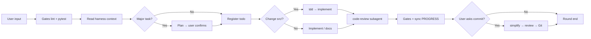
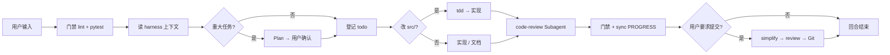

# round-harness

[](LICENSE)
[](https://github.com/HYX-LHJ/round-harness/actions/workflows/validate-scaffold.yml)

**Languages:** [English](#english) · [中文](#中文)

---

<a id="english"></a>

## English

**Scaffold a standard AI agent collaboration harness in any repository — one command, any agent tool.**

round-harness ships the portable Agent Skill [`agent-harness`](agent-harness/). Install it in **Cursor**, **Codex**, **Claude Code**, or via the universal [Skills CLI](https://skills.sh/), then tell your agent to create harness — it generates the full `harness/` tree, `AGENTS.md` playbook, gate scripts, and collaboration workflow.

### Why

AI-assisted development often fails on **structure**, not model capability:

- Context resets every conversation
- Code ships without tests or review gates
- Plans and reviews live only in chat, not in version control

round-harness turns these into **reusable engineering conventions**: directories as protocol, files as state, scripts as gates.

### Quick start

1. **Get the skill** — see [docs/installation.md](docs/installation.md)

   ```bash
   # Universal (Skills CLI) — installs to Cursor, Codex, Claude Code, etc.
   npx skills add HYX-LHJ/round-harness --skill agent-harness -g -y

   # Or clone and copy agent-harness/ to your tool's skill directory
   git clone https://github.com/HYX-LHJ/round-harness.git
   ```

   Full CLI guide: [docs/skills-cli.md](docs/skills-cli.md)

2. **Initialize harness** in a target repo — tell your agent:

   > Use agent-harness to create harness in this repository

   Or run manually:

   ```bash
   python path/to/agent-harness/scripts/init_harness.py --root /path/to/repo --project-name my_api
   ```

3. **Start collaborating** — agents read `AGENTS.md` + `harness/todo.md` / `PROGRESS.md` each round.

### Supported agent tools

| Tool | Install doc |
|------|-------------|
| Cursor | [installation.md](docs/installation.md#cursor) |
| Codex | [installation.md](docs/installation.md#codex) |
| Claude Code | [installation.md](docs/installation.md#claude-code) |
| Universal / Skills CLI | [installation.md](docs/installation.md#universal--cross-agent) |

### What gets generated

```text
your-repo/
├── AGENTS.md          # Agent playbook
├── pytest.ini
└── harness/           # todo, PROGRESS, plans, code_review, scripts, …
```

See [docs/architecture.md](docs/architecture.md).

### Workflow overview



Details: [docs/workflow.md](docs/workflow.md)

### Documentation

| Doc | Audience | Content |
|-----|----------|---------|
| [docs/installation.md](docs/installation.md) | Humans | Multi-tool install (Cursor, Codex, Claude Code, CLI) |
| [docs/skills-cli.md](docs/skills-cli.md) | Humans | `npx skills` commands & agent flags |
| [docs/getting-started.md](docs/getting-started.md) | Humans | First-time setup |
| [docs/architecture.md](docs/architecture.md) | Humans | Directory layout |
| [docs/workflow.md](docs/workflow.md) | Humans | Rounds, commits, Plan mode |
| [agent-harness/SKILL.md](agent-harness/SKILL.md) | Agents | Skill instructions |

### Requirements

- **Python 3.10+** (scaffold & maintenance scripts)
- **An agent tool** that loads `SKILL.md` skills (Cursor, Codex, Claude Code, …)
- For gates in target repos: `.venv`, `ruff`, `pyright`, `pytest`

### Contributing & license

[CONTRIBUTING.md](CONTRIBUTING.md) · [SECURITY.md](SECURITY.md) · [CHANGELOG.md](CHANGELOG.md) · [MIT License](LICENSE)

---

<a id="chinese"></a>

## 中文

**在任意代码仓库中，一键搭建标准化的 AI Agent 协作工程 — 支持多种 Agent 工具。**

round-harness 提供可移植的 Agent Skill 包 [`agent-harness`](agent-harness/)。可安装于 **Cursor**、**Codex**、**Claude Code**，或通过通用 [Skills CLI](https://skills.sh/) 安装。对 Agent 说一句话，即可生成完整的 `harness/` 目录树、`AGENTS.md` Playbook、门禁脚本与协作流程。

### 为什么需要它

AI 辅助开发的瓶颈常在**协作结构**，而非模型能力：

- 每轮对话上下文断裂
- 改完就提交，缺少测试与审查门禁
- Plan、审查、进度只留在聊天里，无法追溯

round-harness 将这些变成**可复用的工程约定**：目录即协议、文件即状态机、脚本即门禁。

### 快速开始

1. **安装 Skill** — 见 [docs/installation.md](docs/installation.md)

   ```bash
   # 通用方式（Skills CLI）— 可安装到 Cursor、Codex、Claude Code 等
   npx skills add HYX-LHJ/round-harness --skill agent-harness -g -y

   # 或克隆后复制 agent-harness/ 到对应工具的 Skill 目录
   git clone https://github.com/HYX-LHJ/round-harness.git
   ```

   CLI 完整指南：[docs/skills-cli.md](docs/skills-cli.md)

2. **在目标仓库初始化 harness** — 对 Agent 说：

   > 用 agent-harness 在当前仓库创建 harness

   或手动执行：

   ```bash
   python path/to/agent-harness/scripts/init_harness.py --root /path/to/repo --project-name my_api
   ```

3. **开始协作** — 每轮 Agent 读取 `AGENTS.md` 与 `harness/todo.md` / `PROGRESS.md`。

### 支持的 Agent 工具

| 工具 | 安装说明 |
|------|----------|
| Cursor | [installation.md](docs/installation.md#cursor) |
| Codex | [installation.md](docs/installation.md#codex) |
| Claude Code | [installation.md](docs/installation.md#claude-code) |
| 通用 / Skills CLI | [installation.md](docs/installation.md#universal--cross-agent) |

### 初始化后会生成什么

```text
your-repo/
├── AGENTS.md          # Agent Playbook
├── pytest.ini
└── harness/           # todo、PROGRESS、plans、code_review、scripts 等
```

详见 [docs/architecture.md](docs/architecture.md)。

### 协作流程概览



详细流程：[docs/workflow.md](docs/workflow.md)

### 文档索引

| 文档 | 读者 | 内容 |
|------|------|------|
| [docs/installation.md](docs/installation.md) | 人类 | 多工具安装（Cursor、Codex、Claude Code、CLI） |
| [docs/skills-cli.md](docs/skills-cli.md) | 人类 | `npx skills` 命令与 agent 参数 |
| [docs/getting-started.md](docs/getting-started.md) | 人类 | 入门与首次配置 |
| [docs/architecture.md](docs/architecture.md) | 人类 | 目录架构 |
| [docs/workflow.md](docs/workflow.md) | 人类 | 回合流程、提交、Plan |
| [agent-harness/SKILL.md](agent-harness/SKILL.md) | Agent | Skill 主指令 |

### 要求

- **Python 3.10+**（脚手架与维护脚本）
- **支持 `SKILL.md` 的 Agent 工具**（Cursor、Codex、Claude Code 等）
- 目标项目跑通门禁：`.venv`、`ruff`、`pyright`、`pytest`

### 参与贡献与许可证

[CONTRIBUTING.md](CONTRIBUTING.md) · [SECURITY.md](SECURITY.md) · [CHANGELOG.md](CHANGELOG.md) · [MIT License](LICENSE)
