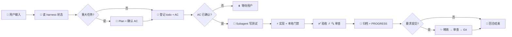

# mini-harness

[](LICENSE)
[](https://github.com/HYX-LHJ/mini-harness/actions/workflows/validate-scaffold.yml)
[](https://github.com/HYX-LHJ/mini-harness/releases)

> 🧩 **让 AI 编码 Agent 像团队一样协作** — 有状态、有门禁、有验收，不再每开新对话就「失忆」。

**[English README](README.en.md)** · [5 分钟试用](mini-harness/TRIAL.md) · [更新日志](CHANGELOG.md)

---

## ✨ 一句话

**可移植的 Agent 工作流插件** — 装插件即得 **using-harness skill**（每回合 Playbook）；在仓库跑一次 `install`，生成 `harness/` 状态目录。支持 **Cursor · Codex · Claude Code**。

---

## 🤔 为什么需要它？

| 😵 没有 harness | ✅ 有 harness |
|----------------|---------------|
| 每开新对话从零开始 | `PROGRESS.md` + `todo.md` **无缝接手** |
| 改完就提交，质量靠运气 | **pytest / ruff / mypy 门禁** + subagent 审查 |
| Plan、审查只在聊天里 | **落盘到 git**，可追溯 |
| 每人一套 Prompt | 统一 **using-harness skill** |
| 项目规矩口口相传 | `profile/PROJECT.md` **随项目进化** |

---

## 🚀 快速开始

### 1️⃣ 安装插件（一键）

| 宿主 | 操作 |
|------|------|
| **Claude Code** | `/plugin marketplace add HYX-LHJ/mini-harness` → `/plugin install mini-harness@mini-harness` |
| **Cursor** | Dashboard → Plugins → 导入 `https://github.com/HYX-LHJ/mini-harness` → 安装 **mini-harness** |
| **Codex** | `codex plugin marketplace add github.com/HYX-LHJ/mini-harness` → `codex plugin install mini-harness` |

📖 详见 [安装指南](docs/zh-CN/installation.md)

### 2️⃣ 在目标仓库激活 harness

```bash
python mini-harness/scripts/mini_harness.py install --root .
python harness/scripts/mini_harness.py doctor --root .
```

看到 `ok: true` 就可以开 Agent 会话了 🎉

> 💡 **第一次试用？** 跟着 [TRIAL.md](mini-harness/TRIAL.md) 走一遍，约 5 分钟。

---

## 📦 你会得到什么

| 产物 | 作用 |
|------|------|
| `skills/using-harness/SKILL.md` | 📋 每回合 Playbook（插件内；`install` 后位于 `harness/skills/`） |
| `harness/todo.md` | ✅ 当前任务与验收标准（AC） |
| `harness/PROGRESS.md` | 📍 进度快照，新会话一眼接手 |
| `harness/profile/PROJECT.md` | 🎯 项目画像 — Agent 每回合必读，可随协作进化 |
| `harness/DECISIONS.md` | 🏛️ 按主题归档的重大决策（背景 / 结论 / 影响） |
| `harness/skills/` | 🛠️ 内置 Skill（tdd、code-review、acceptance…） |
| `harness/scripts/` | ⚙️ `mini_harness.py`（install / update / doctor） |
| `tests/` | 🧪 全部测试文件（仓库根目录） |

<details>
<summary>📂 生成后的目录结构</summary>

```text
your-repo/
├── tests/
└── harness/
    ├── todo.md、PROGRESS.md、DECISIONS.md
    ├── profile/          # PROJECT.md、evolution.jsonl（项目自有，update 不覆盖）
    ├── skills/、scripts/
    ├── plans/、acceptance/、code_review/、backlog/
    └── ...
```

</details>

---

## 🔄 协作流程一览



详见 [协作流程](docs/zh-CN/workflow.md)

---

## 🏗️ 本仓库是什么

这是 **插件源码仓库**，不是已激活 harness 的项目。

```text
mini-harness/   # 🔧 权威插件源码（skills、安装器、模板）
docs/           # 📚 用户文档
.github/        # 🤖 CI / Release
```

只改 `mini-harness/`；在你自己的项目执行 `install` 才会生成 `harness/`、`tests/`。**不要**把 install 产物提交回本仓库。

---

## 📚 文档

| 中文 | English |
|------|---------|
| [快速入门](docs/zh-CN/getting-started.md) | [Getting started](docs/en/getting-started.md) |
| [安装指南](docs/zh-CN/installation.md) | [Installation](docs/en/installation.md) |
| [架构说明](docs/zh-CN/architecture.md) | [Architecture](docs/en/architecture.md) |
| [协作流程](docs/zh-CN/workflow.md) | [Workflow](docs/en/workflow.md) |

插件维护：[mini-harness/README.md](mini-harness/README.md) · [using-harness](mini-harness/skills/using-harness/SKILL.md)

---

## ⚙️ 要求

Python 3.10+ · 支持 Skill / 插件的 Agent 工具 · 可选：`ruff`、`pytest`、`mypy`

---

[🤝 参与贡献](CONTRIBUTING.md) · [🔒 安全](SECURITY.md) · [📋 更新日志](CHANGELOG.md) · [MIT License](LICENSE)
