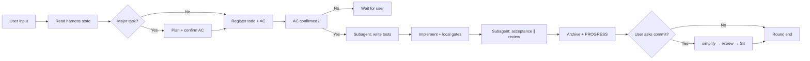

# mini-harness

[](LICENSE)
[](https://github.com/HYX-LHJ/mini-harness/actions/workflows/validate-scaffold.yml)

**[中文 README](README.zh-CN.md)**

---

## In one sentence

**A portable Agent workflow plugin** — one command to activate a mini collaboration harness (`harness/`, `AGENTS.md`, built-in skills) in any repo. Works with **Cursor · Codex · Claude Code**.

---

## Quick start

**Activate in your project:**

```bash
python mini-harness/scripts/mini_harness.py install --root .
python harness/scripts/mini_harness.py doctor --root .
```

**Optional — install the host plugin** (session-start reminders only; activation still requires `install` above):

| Host | Local test |
|------|------------|
| Cursor | Copy or symlink `mini-harness/` to `~/.cursor/plugins/local/mini-harness` |
| Claude Code | `claude --plugin-dir /path/to/mini-harness` |
| Codex | Install from marketplace; trust hooks and start a new session |

First time? See [mini-harness/TRIAL.md](mini-harness/TRIAL.md) (5-minute walkthrough).

---

## Why you need this

| Without harness | With harness |
|-----------------|--------------|
| Every new chat starts from zero | `PROGRESS.md` + `todo.md` for **session handoff** |
| Code ships without tests or review | **pytest / ruff / mypy gates** + subagent review |
| Plans and reviews only in chat | **Committed to git** |
| Everyone uses a different prompt | Shared **`AGENTS.md` playbook** |

---

## What you get

| Artifact | Purpose |
|----------|---------|
| `AGENTS.md` | Per-round playbook (project root) |
| `harness/todo.md` | Current task + acceptance criteria (AC) |
| `harness/PROGRESS.md` | Progress snapshot |
| `harness/skills/` | Built-in skills (tdd, code-review, acceptance, …) |
| `harness/scripts/` | `mini_harness.py` (install / update / doctor) |
| `tests/` | All test files (repo root) |

<details>
<summary>Generated layout</summary>

```text
your-repo/
├── AGENTS.md
├── tests/
└── harness/
    ├── todo.md, PROGRESS.md, DECISIONS.md
    ├── skills/, rules/, scripts/
    ├── plans/, acceptance/, code_review/, backlog/
    └── ...
```

</details>

---

## Documentation

| English | 中文 |
|---------|------|
| [docs/en/](docs/en/) | [docs/zh-CN/](docs/zh-CN/) |
| [Getting started](docs/en/getting-started.md) | [快速入门](docs/zh-CN/getting-started.md) |
| [Installation](docs/en/installation.md) | [安装指南](docs/zh-CN/installation.md) |
| [Architecture](docs/en/architecture.md) | [架构说明](docs/zh-CN/architecture.md) |
| [Workflow](docs/en/workflow.md) | [协作流程](docs/zh-CN/workflow.md) |

Plugin maintainer docs: [mini-harness/README.md](mini-harness/README.md) · [mini-harness/skills/mini-harness/SKILL.md](mini-harness/skills/mini-harness/SKILL.md)

---

## Workflow overview



Details: [docs/en/workflow.md](docs/en/workflow.md)

---

## Requirements

Python 3.10+ · Agent tool with skill / plugin support · Optional: `ruff`, `pytest`, `mypy`

[CONTRIBUTING.md](CONTRIBUTING.md) · [SECURITY.md](SECURITY.md) · [CHANGELOG.md](CHANGELOG.md) · [MIT License](LICENSE)
