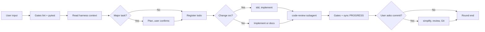

# round-harness

[](LICENSE)
[](https://github.com/HYX-LHJ/round-harness/actions/workflows/validate-scaffold.yml)

**[中文 README](README.zh-CN.md)**

> Skill 包（`agent-harness/`）内部文档与生成模板默认**中文**；本文件为对外英文说明。

---

## In one sentence

A portable **Agent Skill** — tell your agent one sentence, get a full collaboration harness (`harness/`, `AGENTS.md`, gate scripts) in **any repo**, turning AI coding from chat into structured engineering rounds.

```bash
npx skills add HYX-LHJ/round-harness --skill agent-harness -g -y
```

Works with **Cursor · Codex · Claude Code · [Skills CLI](https://skills.sh/) (60+ agents)**

---

## Why you need this

Models keep getting stronger, but for many teams the bottleneck is **not the model — it's missing collaboration structure**:

| Without harness | With harness |
|-----------------|--------------|
| Every new chat starts from zero — context is lost | `PROGRESS.md` + `todo.md` let the next session **pick up where you left off** |
| Code ships without tests or review gates | **lint + pytest gates** — on failure, fix gates first |
| Plans and reviews live only in chat | Plans and reviews are **committed to git** |
| Everyone uses a different prompt | `AGENTS.md` is a **shared playbook** for the whole team |

**What round-harness does:** turn these conventions into a **copy-paste, version-controlled, one-command** scaffold — no hand-written `AGENTS.md`, no ad-hoc folder design.

---

## What this Skill delivers

After installing [`agent-harness`](agent-harness/) and initializing in your target repo:

| Artifact | Purpose |
|----------|---------|
| **`AGENTS.md`** | Per-round playbook: when to Plan, TDD, Code Review, and how to commit |
| **`harness/todo.md`** | Weekly task board — register changes first, checkable acceptance criteria |
| **`harness/PROGRESS.md`** | Snapshot: branch, gates, in-progress tasks — **onboarding entry for new sessions** |
| **`harness/DECISIONS.md`** | Architecture boundaries and “do not commit” rules |
| **`harness/plans/`** | Major tasks: write plan, wait for confirmation, then code |
| **`harness/code_review/`** | Review reports on disk + open findings tracking |
| **`harness/scripts/`** | `lint_src` · `sync_progress` · `archive_harness_todo` |
| **`pytest.ini`** | Test config (`harness/tests`) |

**Initialize with one agent prompt:**

> Use agent-harness to create harness in this repository

<details>
<summary>Generated layout</summary>

```text
your-repo/
├── AGENTS.md                 # Playbook (highest priority)
├── pytest.ini
└── harness/
    ├── index.md
    ├── todo.md
    ├── PROGRESS.md
    ├── DECISIONS.md
    ├── plans/
    ├── code_review/
    ├── code_simplifier/
    ├── tests/
    ├── scripts/
    └── backlog/
```

</details>

---

## Get started in 30 seconds

```bash
# 1. Install the Skill (global — Cursor, Codex, Claude Code, etc.)
npx skills add HYX-LHJ/round-harness --skill agent-harness -g -y

# 2. Open your project and tell your agent:
#    "Use agent-harness to create harness in this repository"

# 3. Each round: agent reads AGENTS.md + harness/todo.md + PROGRESS.md
```

Manual install & other tools → [docs/installation.md](docs/installation.md) · CLI guide → [docs/skills-cli.md](docs/skills-cli.md)

---

## Workflow overview



Each user message = one **round**: gates → read context → [Plan] → todo → [tdd] → implement → [code-review] → gates → PROGRESS. On commit: simplify → second review → Git.

Details: [docs/workflow.md](docs/workflow.md)

---

## Supported tools

| Tool | Install |
|------|---------|
| Cursor | [installation.md](docs/installation.md#cursor) |
| Codex | [installation.md](docs/installation.md#codex) |
| Claude Code | [installation.md](docs/installation.md#claude-code) |
| Skills CLI | [skills-cli.md](docs/skills-cli.md) |

---

## Documentation

| Doc | Content |
|-----|---------|
| [getting-started.md](docs/getting-started.md) | First-time setup |
| [installation.md](docs/installation.md) | Multi-tool install |
| [architecture.md](docs/architecture.md) | Directory layout |
| [workflow.md](docs/workflow.md) | Rounds, commits, Plan mode |
| [SKILL.md](agent-harness/SKILL.md) | Agent instructions |

---

## Requirements

- **Python 3.10+** (scaffold & maintenance scripts)
- **Agent tool** with `SKILL.md` support
- Optional for gates: `.venv`, `ruff`, `pyright`, `pytest`

---

## Contributing & license

[CONTRIBUTING.md](CONTRIBUTING.md) · [SECURITY.md](SECURITY.md) · [CHANGELOG.md](CHANGELOG.md) · [MIT License](LICENSE)
