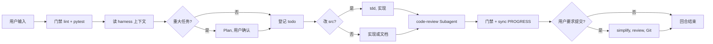

# mini-harness

[](LICENSE)
[](https://github.com/HYX-LHJ/mini-harness/actions/workflows/validate-scaffold.yml)

**[English README](README.md)**

---

## 一句话

**轻量级 Agent Skill（中文 + 英文两个包）** — 一条命令，在任意仓库生成 mini 协作工程（`harness/`、`AGENTS.md`、门禁脚本）。支持 **Cursor · Codex · Claude Code · [Skills CLI](https://skills.sh/)**。

---

## 选择 Skill 包

| 语言 | 包路径 | 安装 |
|------|--------|------|
| **中文** | [`agent-harness-zh/`](agent-harness-zh/) | `npx skills add HYX-LHJ/mini-harness --skill agent-harness-zh -g -y` |
| **English** | [`agent-harness-en/`](agent-harness-en/) | `npx skills add HYX-LHJ/mini-harness --skill agent-harness-en -g -y` |

两个包流程相同；**模板与生成的 `AGENTS.md` 语言与所选包一致**。

**在目标项目中初始化：**

> 用 agent-harness 在当前仓库创建 harness  
> （安装 `agent-harness-zh` 生成中文模板，或 `agent-harness-en` 生成英文模板）

---

## 为什么需要它

| 没有 harness | 有 harness |
|-------------|-----------|
| 每开新对话从零开始 | `PROGRESS.md` + `todo.md` **无缝接手** |
| 改完就提交 | **lint + pytest 门禁** |
| Plan、审查只在聊天里 | **落盘到 git** |
| 每人一套 Prompt | 统一 **`AGENTS.md` Playbook** |

---

## 你会得到什么

| 产物 | 作用 |
|------|------|
| `AGENTS.md` | 每回合 Playbook |
| `harness/todo.md` | 周任务板 |
| `harness/PROGRESS.md` | 进度快照 |
| `harness/plans/` | 重大任务先方案后编码 |
| `harness/code_review/` | 审查报告落盘 |
| `harness/scripts/` | 门禁与维护脚本 |

<details>
<summary>生成后的目录结构</summary>

```text
your-repo/
├── AGENTS.md
├── pytest.ini
└── harness/
    ├── todo.md、PROGRESS.md、DECISIONS.md
    ├── plans/、code_review/、tests/、scripts/
    └── ...
```

</details>

---

## 文档

| 中文 | English |
|------|---------|
| [docs/zh-CN/](docs/zh-CN/) | [docs/en/](docs/en/) |
| [快速入门](docs/zh-CN/getting-started.md) | [Getting started](docs/en/getting-started.md) |
| [安装指南](docs/zh-CN/installation.md) | [Installation](docs/en/installation.md) |
| [架构说明](docs/zh-CN/architecture.md) | [Architecture](docs/en/architecture.md) |
| [协作流程](docs/zh-CN/workflow.md) | [Workflow](docs/en/workflow.md) |
| [Skills CLI](docs/zh-CN/skills-cli.md) | [Skills CLI](docs/en/skills-cli.md) |

---

## 协作流程概览



详见 [docs/zh-CN/workflow.md](docs/zh-CN/workflow.md)

---

## 要求

Python 3.10+ · 支持 `SKILL.md` 的 Agent 工具 · 可选：`ruff`、`pyright`、`pytest`

[CONTRIBUTING.md](CONTRIBUTING.md) · [SECURITY.md](SECURITY.md) · [CHANGELOG.md](CHANGELOG.md) · [MIT License](LICENSE)
