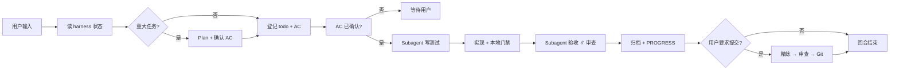

# mini-harness

[](LICENSE)
[](https://github.com/HYX-LHJ/mini-harness/actions/workflows/validate-scaffold.yml)

**[English README](README.md)**

---

## 一句话

**可移植的 Agent 工作流插件** — 一条命令在任意仓库激活 mini 协作工程（`harness/`、`AGENTS.md`、内置 Skills）。支持 **Cursor · Codex · Claude Code**。

---

## 快速开始

**在目标仓库激活：**

```bash
python mini-harness/scripts/mini_harness.py install --root .
python harness/scripts/mini_harness.py doctor --root .
```

**可选 — 安装宿主插件**（仅 Session 开场提醒；仓库仍须执行上面的 `install`）：

| 宿主 | 本地测试 |
|------|----------|
| Cursor | 将 `mini-harness/` 复制或符号链接到 `~/.cursor/plugins/local/mini-harness` |
| Claude Code | `claude --plugin-dir /path/to/mini-harness` |
| Codex | 从市场安装；信任钩子并新开会话 |

第一次试用？见 [mini-harness/TRIAL.md](mini-harness/TRIAL.md)（约 5 分钟）。

---

## 为什么需要它

| 没有 harness | 有 harness |
|-------------|-----------|
| 每开新对话从零开始 | `PROGRESS.md` + `todo.md` **无缝接手** |
| 改完就提交 | **pytest / ruff / mypy 门禁** + subagent 审查 |
| Plan、审查只在聊天里 | **落盘到 git** |
| 每人一套 Prompt | 统一 **`AGENTS.md` Playbook** |

---

## 你会得到什么

| 产物 | 作用 |
|------|------|
| `AGENTS.md` | 每回合 Playbook（项目根目录） |
| `harness/todo.md` | 当前任务与验收标准（AC） |
| `harness/PROGRESS.md` | 进度快照 |
| `harness/skills/` | 内置 Skill（tdd、code-review、acceptance 等） |
| `harness/scripts/` | `mini_harness.py`（install / update / doctor） |
| `tests/` | 全部测试文件（仓库根目录） |

<details>
<summary>生成后的目录结构</summary>

```text
your-repo/
├── AGENTS.md
├── tests/
└── harness/
    ├── todo.md、PROGRESS.md、DECISIONS.md
    ├── skills/、rules/、scripts/
    ├── plans/、acceptance/、code_review/、backlog/
    └── ...
```

</details>

---

## 文档

| 中文 | English |
|------|---------|
| [docs/zh-CN/](docs/zh-CN/) | [docs/en/](docs/en/) |
| [快速入门](docs/zh-CN/getting-started.md) | [Getting started](docs/en/getting-started.md) |
| [安装指南](docs/zh-CN/installation.md) | [Installation](docs/en/installation.md) |
| [架构说明](docs/zh-CN/architecture.md) | [Architecture](docs/en/architecture.md) |
| [协作流程](docs/zh-CN/workflow.md) | [Workflow](docs/en/workflow.md) |

插件维护文档：[mini-harness/README.md](mini-harness/README.md) · [mini-harness/skills/mini-harness/SKILL.md](mini-harness/skills/mini-harness/SKILL.md)

---

## 协作流程概览



详见 [docs/zh-CN/workflow.md](docs/zh-CN/workflow.md)

---

## 要求

Python 3.10+ · 支持 Skill / 插件的 Agent 工具 · 可选：`ruff`、`pytest`、`mypy`

[CONTRIBUTING.md](CONTRIBUTING.md) · [SECURITY.md](SECURITY.md) · [CHANGELOG.md](CHANGELOG.md) · [MIT License](LICENSE)
