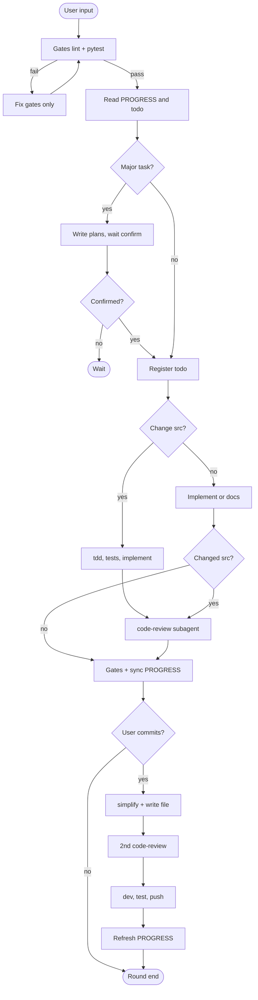

# Workflow

### Concepts

| Concept | Description |
|---------|-------------|
| **Round** | One full workflow per user message |
| **Regular round** | Gates → context → implement → review → PROGRESS |
| **Commit round** | Regular wrap-up + simplify + 2nd review + Git |
| **Plan mode** | Write plan, wait for user confirmation, then code |
| **Gates** | lint + pytest; on failure, fix gates only |
| **Subagent** | Separate agent for review/simplify/explore (dispatch varies by tool) |

> Subagent dispatch differs between Cursor (Task), Claude Code, Codex, etc. Harness **file layout and `AGENTS.md` rules are tool-agnostic**.

### Regular round

```
gates(before) → read harness → [Plan] → register todo → [change src/? → tdd] → implement → [code-review] → gates(after) → PROGRESS
```

1. **Gates (before)** — `lint_src.py` + `pytest`; fail → fix gates only
2. **Read context** — `PROGRESS.md`, `todo.md`, `DECISIONS.md`
3. **Plan** (major tasks) — write `plans/`, wait for confirmation
4. **Register todo** — any change → `todo.md` first
5. **TDD + implement** — if changing `src/`: tests first, then code
6. **Code review** — subagent + write to `code_review/` (not chat-only)
7. **Gates (after) + PROGRESS** — `sync_progress.py` + human sections

### Commit round

Triggered by "commit", "push", etc. After regular wrap-up:

```
…regular… → code-simplifier → 2nd code-review → dev commit → merge test → refresh PROGRESS
```

Skip simplify + 2nd review if only harness/docs changed.

Checklist: [agent-harness-en/references/commit-workflow.md](../../agent-harness-en/references/commit-workflow.md)

### Skill triggers

| Skill | When | Executor | Skip if |
|-------|------|----------|---------|
| `tdd` | After todo, before `src/` | Main agent | No `src/` changes |
| `code-review-expert` | After `src/` changes | Subagent | No `src/` changes |
| `code-simplifier` | Commit with `src/` | Subagent | Harness/docs only |
| `code-review-expert` (2nd) | After simplify, before commit | Subagent | Same as simplifier |

### Plan mode triggers

Enter Plan when **any** applies:

- New feature / API / cross-module change (≥3 dirs)
- Architecture or data model change
- Ambiguous requirements or multiple approaches
- User asks to discuss plan first
- Estimated > 1 day of work

Details: [agent-harness-en/references/plan-mode.md](../../agent-harness-en/references/plan-mode.md)

### Flow diagram


