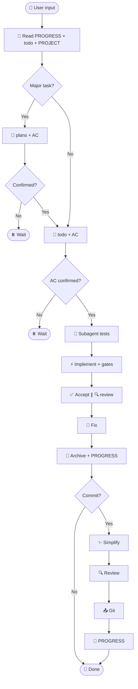

# 🔄 Workflow

Authoritative rules: **`harness/skills/using-harness/SKILL.md`** (plugin: `skills/using-harness/SKILL.md`). This page is a visual overview.

---

## Concepts

| Concept | Meaning |
|---------|---------|
| **Round** | One full flow per user message |
| **AC** | Acceptance criteria in `todo.md`; implement only after **AC confirmed** |
| **Regular round** | Read state → todo → TDD → implement → accept ∥ review → archive |
| **Commit round** | Regular + simplify + 2nd review + Git |
| **Plan** | Write plan, sync AC to todo, wait for user |
| **Subagent** | Tests / acceptance / review / simplify (Task tool) |

> Dispatch differs by host; **harness layout and skills are tool-agnostic**.

---

## Regular round

```text
📖 Read state → [📝 Plan] → todo + AC → ✅ AC confirmed
  → 🧪 subagent(tests) → ⚡ implement → 🚦 gates
  → ✅ accept ∥ 🔍 review → fix → 📁 archive → PROGRESS
```

| Step | Action |
|------|--------|
| 1 | Parallel read `PROGRESS`, `todo`, `PROJECT`; add `DECISIONS` for Plan |
| 2 | Major work → `plans/`, AC in todo |
| 3 | Any change → `todo` + AC table |
| 4 | User confirms AC; **no code until checked** |
| 5 | Subagent writes failing tests |
| 6 | Main agent implements |
| 7 | Local gates |
| 8 | Parallel acceptance + review |
| 9 | Archive to `backlog/`, update `PROGRESS` |

---

## Commit round

User says “commit” / “push”:

```text
…regular… → ✨ simplify → 🔍 review → Git → PROGRESS
```

Simplify and review are **serial**.

---

## Skill triggers

| Skill | When | Who | Skip |
|-------|------|-----|------|
| `brainstorming` | Plan | Main | Small fixes |
| `tdd` + `python-testing-patterns` | Before code | Subagent | Docs only |
| `acceptance-verification` | After implement | Subagent | Docs only |
| `code-review-expert` | After / before commit | Subagent | Docs only |
| `code-simplifier` | Before commit | Subagent | No code change |

Path: `harness/skills/<name>/SKILL.md`

---

## When to Plan?

Any of:

- New feature / API / cross-module
- Architecture or data model change
- Ambiguous requirements or multiple options
- User wants discussion first
- Estimate > 1 day

Details: `harness/docs/plan-mode.md`

---

## 📅 Weekly review

First session of the week → `harness/docs/weekly-review.md`

---

## Diagram



Full rules → [using-harness SKILL](../../mini-harness/skills/using-harness/SKILL.md)
