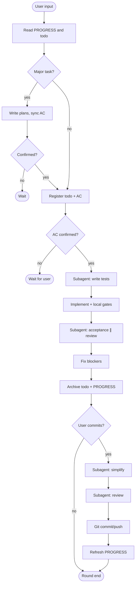

# Workflow

Workflow rules live in `harness/skills/using-harness/SKILL.md` (plugin: `skills/using-harness/SKILL.md`). This page summarizes the collaboration model.

### Concepts

| Concept | Description |
|---------|-------------|
| **Round** | One full workflow per user message |
| **AC** | Acceptance criteria in `todo.md`; user confirmation required before implementation |
| **Regular round** | Read state → todo → AC confirmed → TDD subagent → implement → acceptance ∥ review → archive → PROGRESS |
| **Commit round** | Regular wrap-up + simplify + 2nd review + Git |
| **Plan mode** | Write plan, sync AC to todo, wait for user confirmation |
| **Subagent** | Separate agent for tests, acceptance, review, simplify (via Task tool) |

> Subagent dispatch differs between Cursor (Task), Claude Code, Codex, etc. Harness **file layout and using-harness skill rules are tool-agnostic**.

### Regular round

```
read state → [Plan] → register todo + AC → AC confirmed → subagent(tests) → implement → local gates
  → subagent(acceptance) ∥ subagent(review) → fix blockers → archive todo → PROGRESS
```

1. **Read context** — `PROGRESS.md`, `todo.md`, `profile/PROJECT.md` (parallel); add relevant `DECISIONS.md` topics for Plan / architecture
2. **Plan** (major tasks) — write `plans/`, sync AC to `todo.md`, wait for confirmation
3. **Register todo** — any change → `todo.md` first, with AC table
4. **AC confirmation** — user confirms AC intent; **blocked until checkbox**
5. **TDD subagent** — failing tests in `tests/` (main agent may pre-read code in parallel)
6. **Implement** — main agent writes runtime code (green / refactor)
7. **Local gates** — pytest, ruff, mypy (before subagent reports)
8. **Acceptance ∥ review** — parallel subagents; merge reports, fix blockers
9. **Archive + PROGRESS** — move todo to `backlog/`, update `PROGRESS.md`

### Commit round

Triggered by "commit", "push", etc. After regular wrap-up:

```
…regular… → subagent(code-simplifier) → subagent(code-review) → Git → PROGRESS
```

Simplify and 2nd review are **serial** (simplify may change code).

### Skill triggers

| Skill | When | Executor | Skip if |
|-------|------|----------|---------|
| `brainstorming` | Plan mode | Main agent | Minor fix |
| `tdd` + `python-testing-patterns` | Before runtime code | Subagent | Docs only |
| `acceptance-verification` | After implementation | Subagent | Docs only |
| `code-review-expert` | After implementation; before commit | Subagent | Docs only |
| `code-simplifier` | Before commit | Subagent | No code changes |

Always use `harness/skills/<name>/SKILL.md` — not global skill paths.

### Plan mode triggers

Enter Plan when **any** applies:

- New feature / API / cross-module change
- Architecture or data model change
- Ambiguous requirements or multiple approaches
- User asks to discuss plan first
- Estimated > 1 day of work

Details: `harness/docs/plan-mode.md`

### Weekly review

On the first Monday session (or first session of a new week), follow `harness/docs/weekly-review.md` to archive inactive content.

### Flow diagram



Full rules: `harness/skills/using-harness/SKILL.md` and [mini-harness/skills/using-harness/SKILL.md](../../mini-harness/skills/using-harness/SKILL.md).
