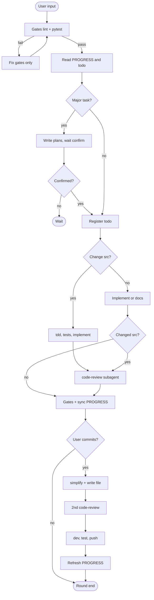
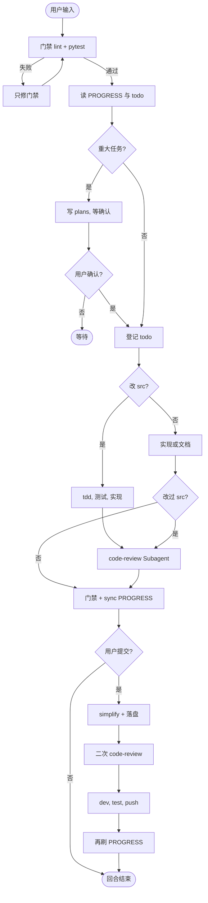

# Workflow / 协作流程

**Languages:** [English](#english) · [中文](#中文)

Hard constraints live in project root `AGENTS.md`. This doc is a human-readable summary.

---

<a id="english"></a>

## English

### Concepts

| Concept | Description |
|---------|-------------|
| **Round** | One full workflow per user message |
| **Regular round** | Gates → context → implement → review → PROGRESS |
| **Commit round** | Regular wrap-up + simplify + 2nd review + Git |
| **Plan mode** | Write plan, wait for user confirmation, then code |
| **Gates** | lint + pytest; on failure, fix gates only |
| **Subagent** | Separate agent for review/simplify/explore (dispatch varies by tool) |

> Subagent dispatch differs between Cursor (Task), Claude Code, Codex, etc. Harness **file layout and `AGENTS.md` rules are tool-agnostic**.

### Regular round

```
gates(before) → read harness → [Plan] → register todo → [change src/? → tdd] → implement → [code-review] → gates(after) → PROGRESS
```

1. **Gates (before)** — `lint_src.py` + `pytest`; fail → fix gates only
2. **Read context** — `PROGRESS.md`, `todo.md`, `DECISIONS.md`
3. **Plan** (major tasks) — write `plans/`, wait for confirmation
4. **Register todo** — any change → `todo.md` first
5. **TDD + implement** — if changing `src/`: tests first, then code
6. **Code review** — subagent + write to `code_review/` (not chat-only)
7. **Gates (after) + PROGRESS** — `sync_progress.py` + human sections

### Commit round

Triggered by "commit", "push", etc. After regular wrap-up:

```
…regular… → code-simplifier → 2nd code-review → dev commit → merge test → refresh PROGRESS
```

Skip simplify + 2nd review if only harness/docs changed.

Checklist: [agent-harness/references/commit-workflow.md](../agent-harness/references/commit-workflow.md)

### Skill triggers

| Skill | When | Executor | Skip if |
|-------|------|----------|---------|
| `tdd` | After todo, before `src/` | Main agent | No `src/` changes |
| `code-review-expert` | After `src/` changes | Subagent | No `src/` changes |
| `code-simplifier` | Commit with `src/` | Subagent | Harness/docs only |
| `code-review-expert` (2nd) | After simplify, before commit | Subagent | Same as simplifier |

### Plan mode triggers

Enter Plan when **any** applies:

- New feature / API / cross-module change (≥3 dirs)
- Architecture or data model change
- Ambiguous requirements or multiple approaches
- User asks to discuss plan first
- Estimated > 1 day of work

Details: [agent-harness/references/plan-mode.md](../agent-harness/references/plan-mode.md)

### Flow diagram



---

<a id="chinese"></a>

## 中文

### 核心概念

| 概念 | 说明 |
|------|------|
| **回合** | 每次用户输入触发一轮完整流程 |
| **常规回合** | 门禁 → 读上下文 → 实现 → 审查 → 刷新 PROGRESS |
| **提交回合** | 常规收尾 + 精炼 + 二次审查 + Git |
| **Plan 模式** | 重大任务先写方案、等用户确认，再写代码 |
| **门禁** | lint + pytest；失败则只修门禁 |
| **Subagent** | 独立 Agent 做审查/精炼/探索（派遣方式因工具而异） |

> Subagent 派遣在 Cursor（Task）、Claude Code、Codex 等工具间不同；harness **目录结构与 `AGENTS.md` 规则与工具无关**。

### 常规回合

```
门禁(前) → 读 harness → [Plan] → 登记 todo → [改 src/? → tdd] → 实现 → [code-review] → 门禁(后) → PROGRESS
```

1. **门禁（前）** — `lint_src.py` + `pytest`；失败则只修门禁
2. **读上下文** — `PROGRESS.md`、`todo.md`、`DECISIONS.md`
3. **Plan**（重大任务）— 写 `plans/`，等用户确认
4. **登记 todo** — 有变更必先写 `todo.md`
5. **TDD + 实现** — 改 `src/`：先测试，后代码
6. **Code Review** — Subagent + 落盘到 `code_review/`（禁止仅聊天）
7. **门禁（后）+ PROGRESS** — `sync_progress.py` + 人文章节

### 提交回合

用户说「提交」「push」等，在常规收尾之后：

```
…常规… → code-simplifier → 二次 code-review → dev 提交 → 同步 test → 再刷 PROGRESS
```

仅 harness/文档变更可跳过精炼与二次审查。

清单：[agent-harness/references/commit-workflow.md](../agent-harness/references/commit-workflow.md)

### Skill 触发

| Skill | 何时 | 执行方 | 跳过条件 |
|-------|------|--------|----------|
| `tdd` | 登记 todo 后、改 `src/` 前 | 主 Agent | 不改 `src/` |
| `code-review-expert` | 改过 `src/`（收尾） | Subagent | 未改 `src/` |
| `code-simplifier` | 提交且含 `src/` | Subagent | 仅 harness/文档 |
| `code-review-expert`（二次） | simplify 后、commit 前 | Subagent | 同 simplifier |

### Plan 模式触发

满足**任一**须先 Plan：

- 新功能 / API / 跨多模块（≥3 目录）
- 架构或数据模型变更
- 需求含糊或多种实现路径
- 用户要求先讨论方案
- 预估 > 1 个工作日

细则：[agent-harness/references/plan-mode.md](../agent-harness/references/plan-mode.md)

### 流程图


