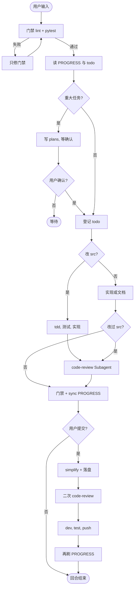

# 协作流程

### 核心概念

| 概念 | 说明 |
|------|------|
| **回合** | 每次用户输入触发一轮完整流程 |
| **常规回合** | 门禁 → 读上下文 → 实现 → 审查 → 刷新 PROGRESS |
| **提交回合** | 常规收尾 + 精炼 + 二次审查 + Git |
| **Plan 模式** | 重大任务先写方案、等用户确认，再写代码 |
| **门禁** | lint + pytest；失败则只修门禁 |
| **Subagent** | 独立 Agent 做审查/精炼/探索（派遣方式因工具而异） |

> Subagent 派遣在 Cursor（Task）、Claude Code、Codex 等工具间不同；harness **目录结构与 `AGENTS.md` 规则与工具无关**。

### 常规回合

```
门禁(前) → 读 harness → [Plan] → 登记 todo → [改 src/? → tdd] → 实现 → [code-review] → 门禁(后) → PROGRESS
```

1. **门禁（前）** — `lint_src.py` + `pytest`；失败则只修门禁
2. **读上下文** — `PROGRESS.md`、`todo.md`、`DECISIONS.md`
3. **Plan**（重大任务）— 写 `plans/`，等用户确认
4. **登记 todo** — 有变更必先写 `todo.md`
5. **TDD + 实现** — 改 `src/`：先测试，后代码
6. **Code Review** — Subagent + 落盘到 `code_review/`（禁止仅聊天）
7. **门禁（后）+ PROGRESS** — `sync_progress.py` + 人文章节

### 提交回合

用户说「提交」「push」等，在常规收尾之后：

```
…常规… → code-simplifier → 二次 code-review → dev 提交 → 同步 test → 再刷 PROGRESS
```

仅 harness/文档变更可跳过精炼与二次审查。

清单：[agent-harness-zh/references/commit-workflow.md](../../agent-harness-zh/references/commit-workflow.md)

### Skill 触发

| Skill | 何时 | 执行方 | 跳过条件 |
|-------|------|--------|----------|
| `tdd` | 登记 todo 后、改 `src/` 前 | 主 Agent | 不改 `src/` |
| `code-review-expert` | 改过 `src/`（收尾） | Subagent | 未改 `src/` |
| `code-simplifier` | 提交且含 `src/` | Subagent | 仅 harness/文档 |
| `code-review-expert`（二次） | simplify 后、commit 前 | Subagent | 同 simplifier |

### Plan 模式触发

满足**任一**须先 Plan：

- 新功能 / API / 跨多模块（≥3 目录）
- 架构或数据模型变更
- 需求含糊或多种实现路径
- 用户要求先讨论方案
- 预估 > 1 个工作日

细则：[agent-harness-zh/references/plan-mode.md](../../agent-harness-zh/references/plan-mode.md)

### 流程图


