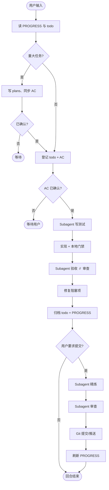

# 协作流程

工作流规则以项目根目录 `AGENTS.md` 为准（由插件复制）。本文概述协作模型。

### 概念

| 概念 | 说明 |
|------|------|
| **回合** | 每条用户消息对应一轮完整流程 |
| **AC** | `todo.md` 中的验收标准；须用户确认后才可实现 |
| **常规回合** | 读状态 → todo → TDD subagent → 实现 → 验收 ∥ 审查 → 归档 → PROGRESS |
| **交付回合** | 常规收尾 + 精炼 + 二次审查 + Git |
| **Plan 模式** | 写方案、AC 同步到 todo、等待用户确认 |
| **Subagent** | 独立 Agent 负责测试、验收、审查、精炼（通过 Task 工具） |

> Subagent 调度因 Cursor（Task）、Claude Code、Codex 等而异；harness **目录布局与 `AGENTS.md` 规则与工具无关**。

### 常规回合

```
读状态 → [Plan] → 登记 todo + AC → AC 已确认 → subagent(写测试) → 实现 → 本地门禁
  → subagent(验收) ∥ subagent(审查) → 修复阻塞项 → 归档 todo → PROGRESS
```

1. **读上下文** — `PROGRESS.md`、`todo.md`、`DECISIONS.md`（并行）
2. **Plan**（重大任务）— 写 `plans/`，AC 同步到 `todo.md`，等待确认
3. **登记 todo** — 有变更先写 `todo.md`，含 AC 表
4. **AC 核对** — 用户确认 AC 意图；**未勾选前不得实现**
5. **TDD subagent** — 在 `tests/` 写 failing 测试（主 Agent 可并行预读代码）
6. **实现** — 主 Agent 编写运行时代码（green / refactor）
7. **本地门禁** — pytest、ruff、mypy（subagent 报告前）
8. **验收 ∥ 审查** — 并行 subagent；合并报告、修复阻塞项
9. **归档 + PROGRESS** — todo 迁入 `backlog/`，更新 `PROGRESS.md`

### 交付回合

用户说「提交」「推送」等时，在常规收尾后：

```
…常规… → subagent(code-simplifier) → subagent(code-review) → Git → PROGRESS
```

精炼与二次审查须**串行**（精炼可能改代码）。

### Skill 触发

| Skill | 时机 | 执行方 | 跳过条件 |
|-------|------|--------|----------|
| `brainstorming` | Plan 模式 | 主 Agent | 小修复 |
| `tdd` + `python-testing-patterns` | 运行时代码前 | Subagent | 仅文档 |
| `acceptance-verification` | 实现完成后 | Subagent | 仅文档 |
| `code-review-expert` | 实现后；提交前 | Subagent | 仅文档 |
| `code-simplifier` | 提交前 | Subagent | 无代码变更 |

始终使用 `harness/skills/<name>/SKILL.md`，**不要**用全局 skill 路径。

### Plan 模式触发

满足**任一**即进入 Plan：

- 新功能 / API / 跨模块变更
- 架构或数据模型变更
- 需求含糊或多方案
- 用户要求先讨论方案
- 预估 > 1 天工作量

细则：`harness/docs/plan-mode.md`

### 周回顾

每周一首个会话（或新自然周首个会话）按 `harness/docs/weekly-review.md` 归档不活跃内容。

### 流程图



完整规则：项目根 `AGENTS.md` 与 [mini-harness/AGENTS.md](../../mini-harness/AGENTS.md)。
