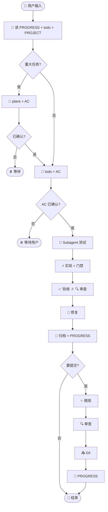

# 🔄 协作流程

权威规则在 **`harness/skills/using-harness/SKILL.md`**（插件内：`skills/using-harness/SKILL.md`）。本文是图解版概览。

---

## 概念

| 概念 | 说明 |
|------|------|
| **回合** | 每条用户消息 = 一轮完整流程 |
| **AC** | `todo.md` 验收标准；**AC 已确认** 后才可实现 |
| **常规回合** | 读状态 → todo → TDD → 实现 → 验收∥审查 → 归档 |
| **交付回合** | 常规 + 精炼 + 二次审查 + Git |
| **Plan** | 写方案、AC 进 todo、等用户点头 |
| **Subagent** | 测试 / 验收 / 审查 / 精炼（Task 工具） |

> 调度方式因 Cursor / Claude / Codex 而异；**harness 目录与 Skill 规则与工具无关**。

---

## 常规回合

```text
📖 读状态 → [📝 Plan] → todo + AC → ✅ AC 已确认
  → 🧪 subagent(测试) → ⚡ 实现 → 🚦 门禁
  → ✅ 验收 ∥ 🔍 审查 → 修复 → 📁 归档 → PROGRESS
```

| 步 | 做什么 |
|----|--------|
| 1 | 并行读 `PROGRESS`、`todo`、`PROJECT`；Plan 时加 `DECISIONS` |
| 2 | 重大任务 → `plans/`，AC 同步 todo |
| 3 | 有变更先写 `todo` + AC 表 |
| 4 | 用户确认 AC；**未勾选不写代码** |
| 5 | Subagent 写 failing 测试 |
| 6 | 主 Agent 实现（green / refactor） |
| 7 | 跑本地门禁 |
| 8 | 并行验收 + 审查，修阻塞项 |
| 9 | 归档 `backlog/`，更新 `PROGRESS` |

---

## 交付回合

用户说「提交」「推送」：

```text
…常规… → ✨ 精炼 → 🔍 审查 → Git → PROGRESS
```

精炼与审查须**串行**。

---

## Skill 触发

| Skill | 时机 | 谁 | 可跳过 |
|-------|------|-----|--------|
| `brainstorming` | Plan | 主 Agent | 小修复 |
| `tdd` + `python-testing-patterns` | 写代码前 | Subagent | 仅文档 |
| `acceptance-verification` | 实现后 | Subagent | 仅文档 |
| `code-review-expert` | 实现后 / 提交前 | Subagent | 仅文档 |
| `code-simplifier` | 提交前 | Subagent | 无代码变更 |

路径：`harness/skills/<name>/SKILL.md`

---

## 何时进 Plan？

满足**任一**：

- 新功能 / API / 跨模块
- 架构或数据模型变更
- 需求含糊或多方案
- 用户要先讨论
- 预估 > 1 天

细则：`harness/docs/plan-mode.md`

---

## 📅 周回顾

新一周首次会话 → `harness/docs/weekly-review.md` 轻量整理。

---

## 流程图



完整规则 → [using-harness SKILL](../../mini-harness/skills/using-harness/SKILL.md)
